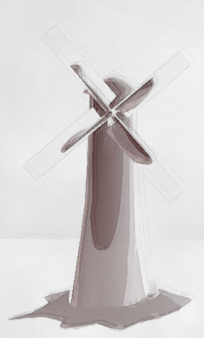

# Shaders

Various projects to test and benchmark several GLSL techniques in SceneKit. 
The majority of the code is written in Swift and targets macOS.

Every example uses multiple rendering passes to achieve an effect close to traditional artistic style. This is not a demonstration in effecient rendering, more of a sandbox for trying various effects. Below are examples of the final results of each project:

## Watercolor

## Impressionist

## Manga

